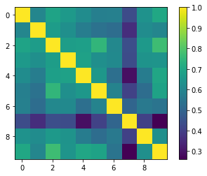

# My solution to Taxi Order Anticipation challenge by Bolt

[Full report here](demand_prediction.pdf)

The distribution of taxi demand points in Tallinn looks like this:

To clusterize the points I used a third-party code that performs K-means clusterization with extra constraints on the minimum (and maximum) number of points in a cluster. The minimum constarint is important to avoid the situation when a distant standalone point gets clustered on its own.

Below is the correlation matrix between the demand in clusters. Cluster 7 is Tallinn city center and it has the lowest correlation with other city areas.

# Original task formulation by Bolt

## Value Based Order Location Anticipation

Availability of supply depends on the duration of time it takes for the drivers to reach the customers. For this test task we expect you to:

- Explore the viability of algorithmic order location anticipation based on the data provided to guide the driver towards areas of highest ride value.
- Build a documented simple baseline model.
- Describe how you would deploy such a model.
- Think through and describe the randomized experiment (AB-test) for live operations.

The goal of the task is to understand your strengths in the data science process. Spend max 8h on it. Enjoy!

Data
The source data is approximately 630000 rows of synthetic ride demand data which resembles the real-life situation in the city of Tallinn:

- start_time - time when the order was made
- start_lat - latitude of the location where the order was made
- start_lng - longitude of the location where the order was made
- end_lat - latitude of the destination point
- end_lng - longitude of the destination point
- ride_value - how much monetary value is in this particular ride

Please describe what additional data would you consider useful and cite the main references used in your solution, if any.